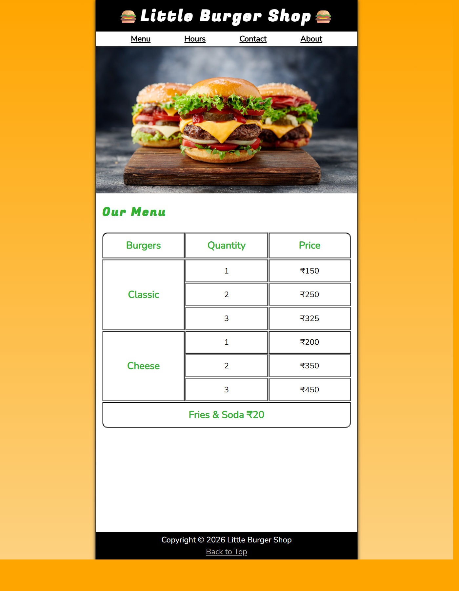
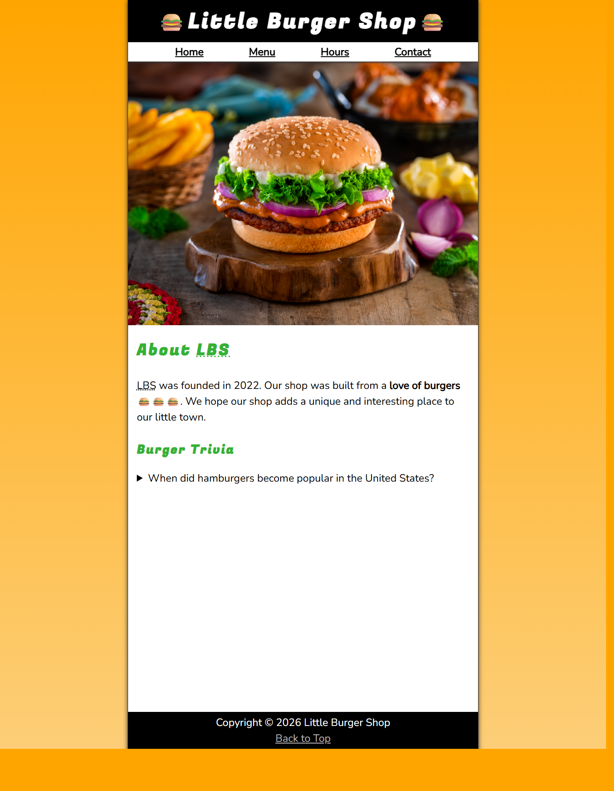
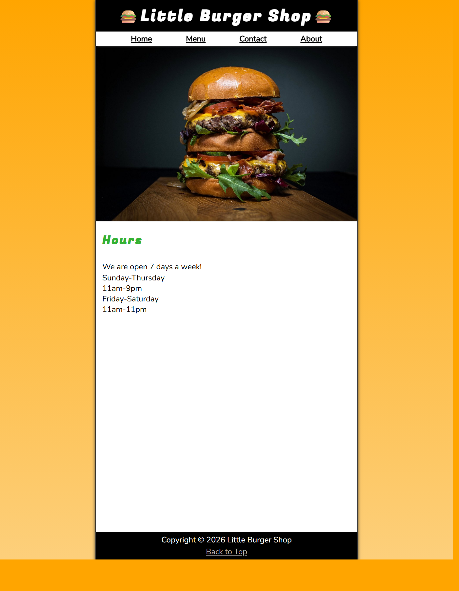
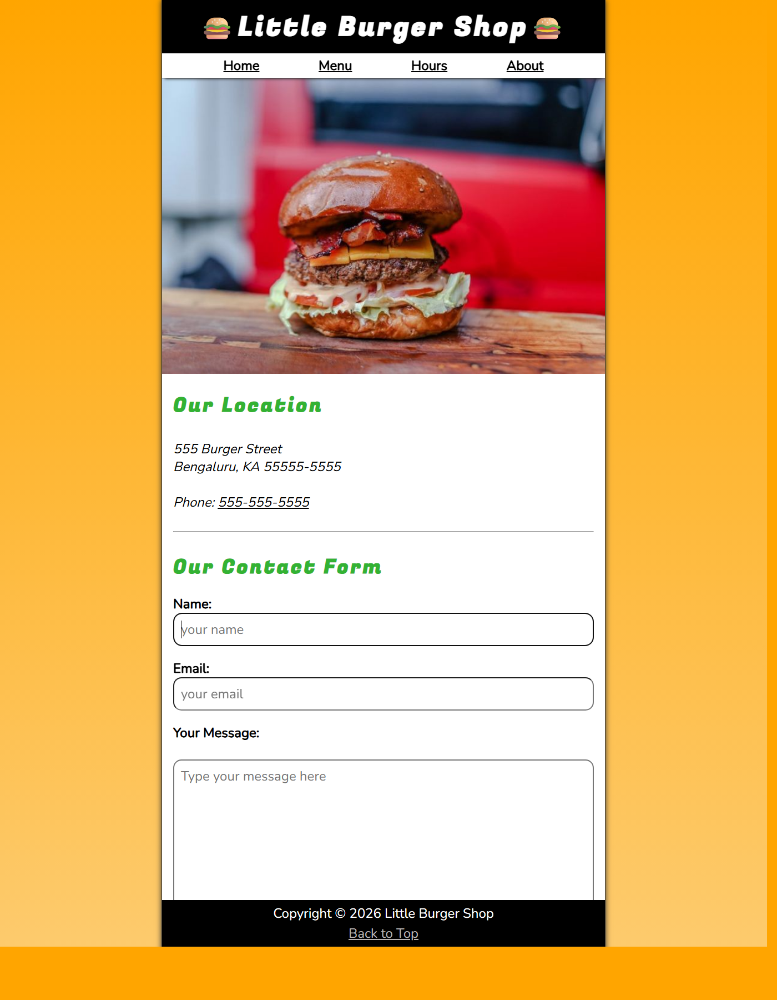
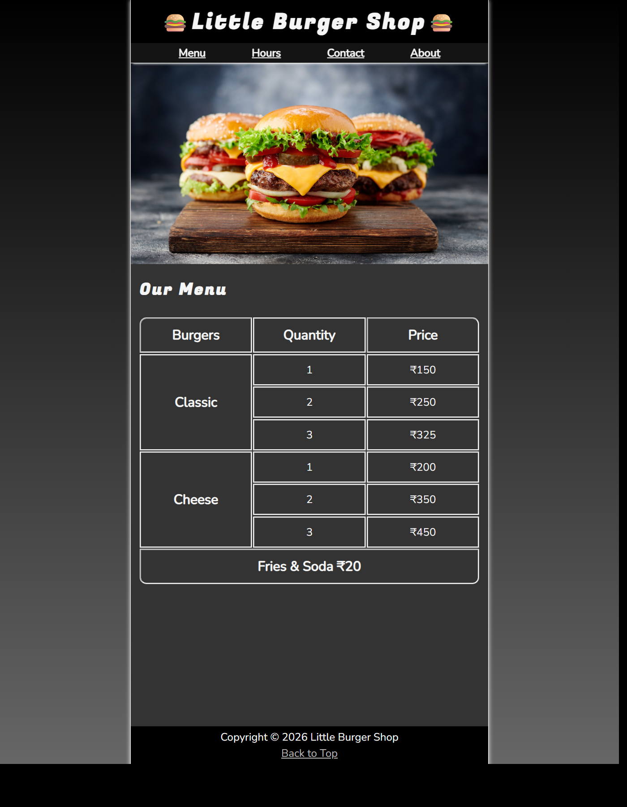
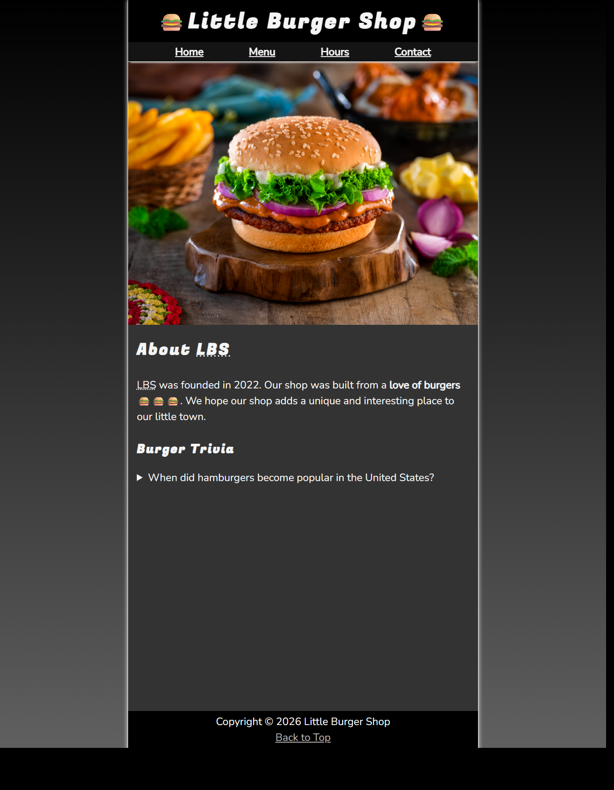
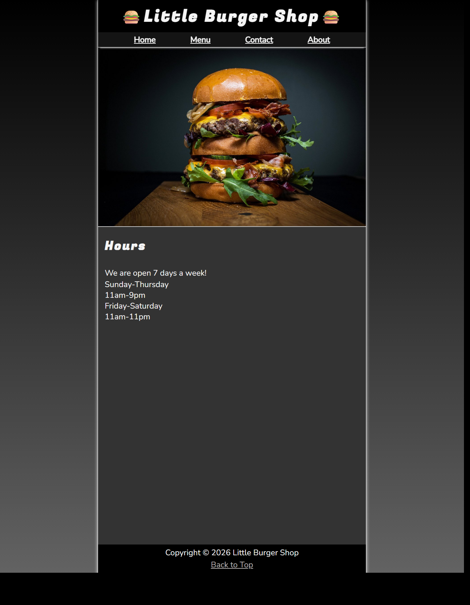
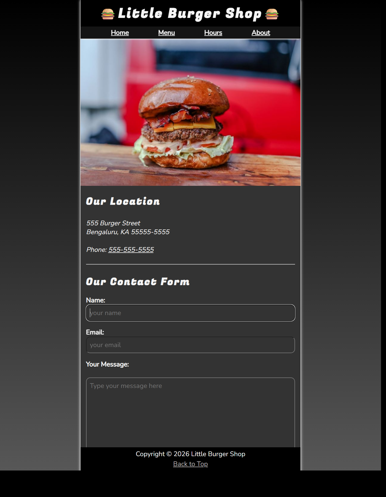

# Little Burger Shop

Little Burger Shop is my first project created after learning HTML and CSS.

This is a simple multi-page restaurant website built using vanilla HTML, vanilla CSS, and very minimal JavaScript.

## Project Highlights

- Built with semantic HTML
- Styled with vanilla CSS
- Uses BEM naming convention for class names
- Includes very minimal JavaScript for the dynamic footer year
- Organized as a beginner-friendly multi-page project

## Pages

- Home
- About
- Hours
- Contact

## Tech Stack

## Screenshots

All page screenshots are available in the [screenshots](screenshots) folder.

### Desktop - Home Page

### Desktop - About Page

### Desktop - Hours Page

### Desktop - Contact Page

### Dark Mode - Home Page

### Dark Mode - About Page

### Dark Mode - Hours Page

### Dark Mode - Contact Page

## Run Locally

Open index.html in your browser.

## Author

Srinivas KR  
Full Stack Developer

GitHub:  
https://github.com/Srinivas-KR-Dev

## License

This project is licensed under the MIT License. See the LICENSE file for details.
